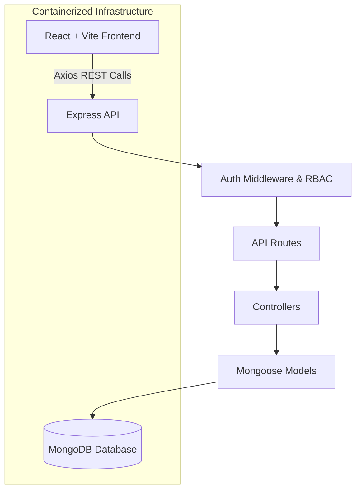

# Smart Leads CRM

Smart Leads is a robust, production-grade Customer Relationship Management (CRM) platform designed to streamline lead acquisition and sales tracking. Engineered as a MERN monorepo, it offers a secure, role-based ecosystem where sales agents can track personal pipelines while administrators oversee the entire dataset. With built-in features like CSV data export, intelligent filtering, and responsive dark mode, it provides an intuitive and powerful experience for modern sales teams.

<p align="center">
  <a href="#deployment"><strong>View Live Demo (Placeholder)</strong></a>
</p>

## ✨ Features Checklist
- [x] **Monorepo Architecture:** Seamlessly orchestrated frontend and backend workspaces.
- [x] **Strict TypeScript:** 100% type-checked across both client and server boundaries.
- [x] **JWT Authentication:** Secure stateless authentication with token persistence.
- [x] **Role-Based Access Control (RBAC):** Admin and Sales Agent hierarchy.
- [x] **Full-Text Search & Filtering:** Debounced queries with dynamic URL synchronization.
- [x] **CSV Exports:** One-click generation of matching leads into downloadable CSV format.
- [x] **Dark Mode:** Elegant, system-synced Light/Dark mode toggling.
- [x] **Containerization:** Fully Dockerized with multi-stage builds and database persistence.
- [x] **Standardized Error Handling:** Global API error interceptors yielding consistent responses.

---

## 🛠️ Tech Stack

### Frontend
- **Framework:** React 18 + Vite
- **Language:** TypeScript
- **Styling:** Tailwind CSS
- **Routing:** React Router v6
- **HTTP Client:** Axios
- **Icons:** Lucide React

### Backend
- **Framework:** Node.js + Express
- **Language:** TypeScript
- **Database:** MongoDB (Mongoose)
- **Authentication:** JWT (JSON Web Tokens)
- **Validation:** express-validator
- **Security:** bcryptjs, helmet, cors

---

## 🏗️ Architecture



---

## 🚀 Getting Started

### Prerequisites
- [Node.js](https://nodejs.org/en) (v18.0.0 or higher)
- [Docker](https://www.docker.com/) and Docker Compose (if using containers)

### Option 1: Docker (Recommended)

1. Clone the repository and navigate into the project directory:
   ```bash
   cd smart-leads
   ```
2. Copy the example environment files for both packages:
   ```bash
   cp server/.env.example server/.env
   cp client/.env.example client/.env
   ```
3. Start the application using Docker Compose:
   ```bash
   docker-compose up --build
   ```
4. Access the client at `http://localhost:80` and the API at `http://localhost:5001`.

### Option 2: Local Development (Without Docker)

1. Clone the repository:
   ```bash
   cd smart-leads
   ```
2. Make sure you have a local instance of MongoDB running on `mongodb://localhost:27017/smart-leads`.
3. Set up the `server`:
   ```bash
   cd server
   cp .env.example .env
   npm install
   npm run dev
   ```
4. In a separate terminal, set up the `client`:
   ```bash
   cd client
   cp .env.example .env
   npm install
   npm run dev
   ```

---

## 🔐 Environment Variables

Ensure the following variables are configured in your respective `.env` files.

### Server (`server/.env`)

| Key | Description | Example Value |
| --- | ----------- | ------------- |
| `PORT` | API listening port | `5001` |
| `MONGODB_URI` | MongoDB connection string | `mongodb://localhost:27017/smart-leads` |
| `JWT_SECRET` | Secret key for signing JWTs | `super_secret_jwt_key_123` |
| `JWT_EXPIRES_IN` | Lifespan of generated tokens | `7d` |
| `CLIENT_URL` | Allowed CORS origin | `http://localhost:5173` |

### Client (`client/.env`)

| Key | Description | Example Value |
| --- | ----------- | ------------- |
| `VITE_API_URL` | Base URL targeting the Express backend | `http://localhost:5001/api` |

---

## 📚 API Reference

All requests must be prefixed with `/api`. Protected routes require an `Authorization: Bearer <token>` header.

| Method | Route | Auth | Role | Description | Request Body | Response (Success snippet) |
| --- | --- | --- | --- | --- | --- | --- |
| `POST` | `/auth/register` | No | Any | Register a new user | `{ name, email, password, role }` | `{ success: true, data: { token, user } }` |
| `POST` | `/auth/login` | No | Any | Sign in to an account | `{ email, password }` | `{ success: true, data: { token, user } }` |
| `GET` | `/auth/me` | Yes | Any | Get the currently authenticated user | *None* | `{ success: true, data: { ...user } }` |
| `GET` | `/leads` | Yes | Any | List paginated/filtered leads. Query params: `status`, `source`, `search`, `sort`, `page`, `limit`. Sales see only their own leads. | *None* | `{ data: { leads: [...], total, page, limit, totalPages }}` |
| `GET` | `/leads/export` | Yes | Any | Retrieve all leads matching filters (no pagination) for CSV generation | *None* | `{ success: true, data: [...] }` |
| `GET` | `/leads/:id` | Yes | Any | Retrieve a single lead by ID | *None* | `{ success: true, data: { ...lead } }` |
| `POST` | `/leads` | Yes | Any | Create a new lead | `{ name, email, status?, source }` | `{ success: true, data: { ...lead } }` |
| `PATCH` | `/leads/:id` | Yes | Any | Update a lead's metadata | `{ name?, email?, status?, source? }` | `{ success: true, data: { ...lead } }` |
| `PATCH` | `/leads/:id/status` | Yes | Any | Update only the status of a lead | `{ status }` | `{ success: true, data: { ...lead } }` |
| `DELETE`| `/leads/:id` | Yes | Admin | Permanently delete a lead | *None* | `{ success: true, message: "..." }` |

---

## 📂 Folder Structure

```text
smart-leads/
├── docker-compose.yml       # Production orchestration
├── package.json             # Root monorepo definition
│
├── client/                  # React Frontend (Vite)
│   ├── index.html
│   ├── tailwind.config.js
│   ├── package.json
│   └── src/
│       ├── api/             # Axios instances and endpoint bindings
│       ├── components/      # Reusable UI widgets and forms
│       ├── context/         # AuthContext and ThemeContext
│       ├── hooks/           # Custom React hooks (useDebounce)
│       ├── pages/           # Route-level page components
│       ├── types/           # Global frontend TS interfaces
│       └── utils/           # Helper scripts (csvExport)
│
└── server/                  # Node.js API
    ├── package.json
    ├── tsconfig.json
    └── src/
        ├── controllers/     # Route business logic handlers
        ├── middleware/      # Auth, RBAC, and error handlers
        ├── models/          # Mongoose DB schemas
        ├── routes/          # Express route definitions
        ├── types/           # Global backend TS interfaces
        └── utils/           # Validation and query builders
```

---

## 🌐 Deployment

> **Deployment Status:** `Pending`
> **Live Link:** `https://your-production-url.com` (Placeholder)

*To deploy to production, utilize the provided multi-stage `Dockerfile` structures within both the `client` and `server` packages to deploy to any cloud provider supporting containers (e.g., AWS ECS, Render, Railway).*
